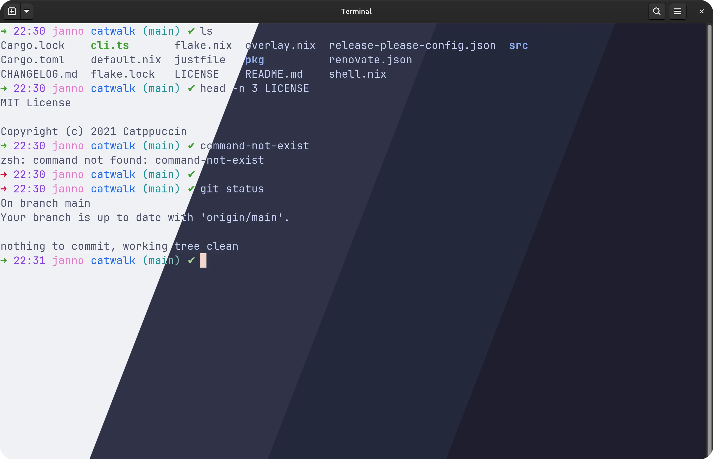
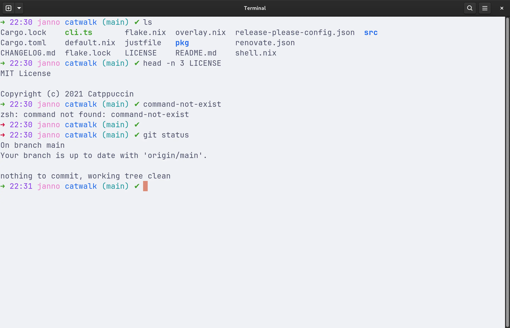
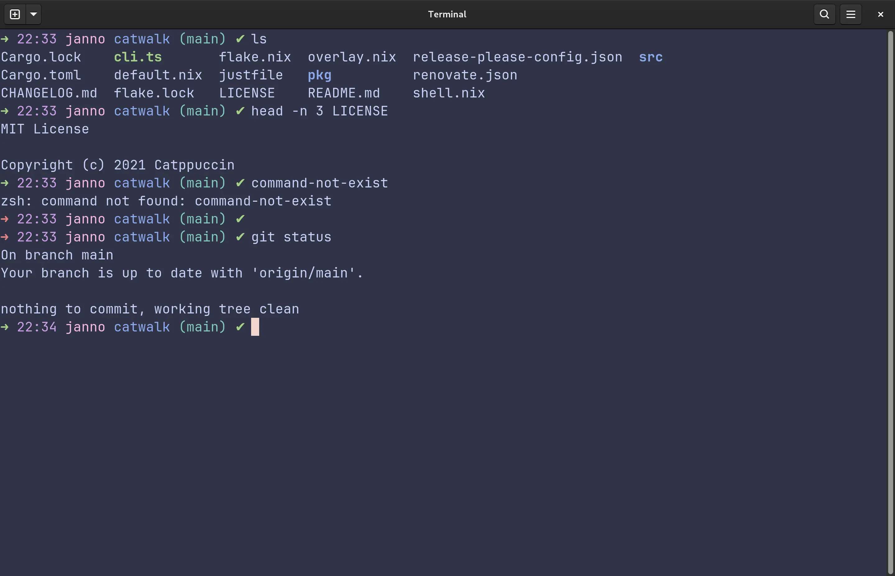
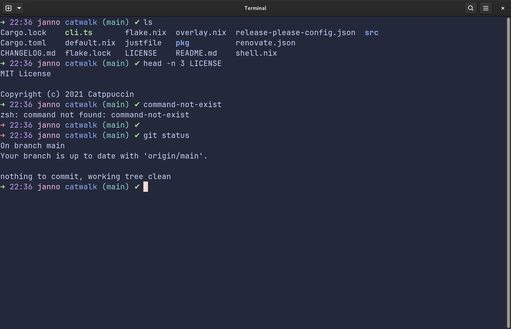
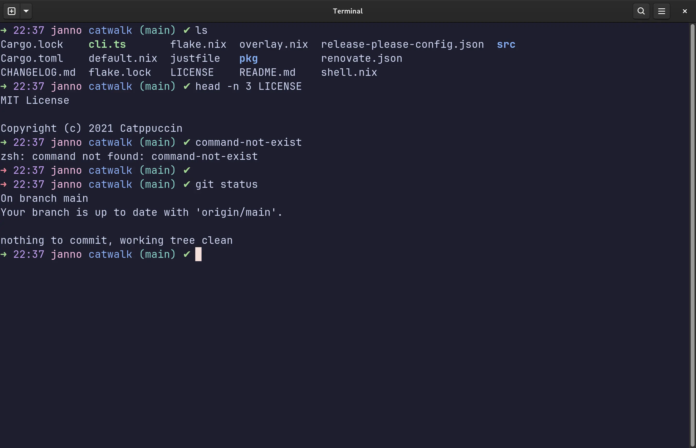

# Catppuccin for zsh

<p align="center">
	
</p>

## Previews

<details>
<summary>🌻 Latte</summary>

</details>
<details>
<summary>🪴 Frappé</summary>

</details>
<details>
<summary>🌺 Macchiato</summary>

</details>
<details>
<summary>🌿 Mocha</summary>

</details>

## Installation
### Using [ohmyzsh](https://github.com/ohmyzsh/ohmyzsh)
``` sh
git clone https://github.com/ColorfulCookie/catppuccin-zsh.git
mkdir ~/.oh-my-zsh/themes/catppuccin-flavors

mv catppuccin-zsh/catppuccin.zsh-theme ~/.oh-my-zsh/themes/
mv catppuccin-zsh/catppuccin-flavors/* ~/.oh-my-zsh/themes/catppuccin-flavors
```

## Setup
Add the following lines to you zsh configuration:
``` sh
ZSH_THEME="catppuccin"
CATPPUCCIN_FLAVOR="latte" # Required! Options: mocha, flappe, macchiato, latte
```
